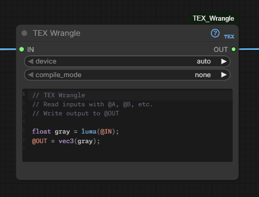

# TEX Wrangle

<p align="center">
  
</p>

### Tensor Expression Language for ComfyUI

<p align="center">
  
</p>

A compact per-pixel DSL inspired by **Houdini VEX**, **VDB AX**, and **Nuke BlinkScript**. Write image, mask, latent, and string processing logic directly in a node — with static typing, GPU acceleration, and 144 stdlib functions.

[](LICENSE)
[](https://python.org)
[](https://github.com/comfyanonymous/ComfyUI)

---

## Quick Start

Add a **TEX Wrangle** node (category: TEX). Write code using `@name` to reference inputs — sockets are created automatically:

```c
// Grayscale — connect any image to the "image" socket
float gray = luma(@image);
@OUT = vec3(gray);
```

**Blend two images** with an adjustable parameter:

```c
f$blend = 0.5;
@OUT = lerp(@base, @overlay, $blend);
```

**Multiple outputs** — each `@name` written to becomes an output socket:

```c
f$strength = 1.0;
@result = @image * $strength;
@mask = luma(@image);
```

Click the **?** icon on the node for a built-in quick reference card.

## Installation

**Prerequisites:** ComfyUI with Python 3.10+ and PyTorch (both included with standard installs). No additional dependencies.

| Method | Instructions |
|--------|-------------|
| **ComfyUI Manager** *(recommended)* | Search "TEX Wrangle" → Install |
| **Git clone** | `cd ComfyUI/custom_nodes && git clone https://github.com/xavinitram/TEX.git TEX_Wrangle` |
| **Manual** | Download & extract into `ComfyUI/custom_nodes/TEX_Wrangle/` |

Restart ComfyUI after installation. The node appears under the **TEX** category.

## Features

| Feature | Details |
|---------|---------|
| **Per-pixel processing** | Code runs on every pixel, automatically vectorized via PyTorch |
| **Static typing** | `float`, `int`, `vec3`, `vec4`, `mat3`, `mat4`, `string`, `T[]` arrays |
| **`@` bindings** | Name inputs freely (`@image`, `@base`, `@overlay`) — sockets auto-created |
| **`$` parameters** | `f$strength = 0.5;` creates adjustable widgets on the node |
| **Multiple outputs** | Write to `@result`, `@mask`, etc. for multiple output sockets |
| **Control flow** | `if/else` (vectorized), `for` loops, `while` loops, `break`/`continue` |
| **GPU acceleration** | CPU or GPU with auto device detection |
| **Acceleration tiers** | `compile_mode`: `none` (default), `auto` (experimental measured auto-tier — trials `torch.compile` in the background and commits only on a measured win; always falls back to a correct path), `torch_compile`, `cuda_graph` (GPU replay for small launch-bound programs) |
| **Precision** | `precision`: `fp32` (default), **`auto`** (fp16 only where it measurably wins and stays accurate — CUDA, ≥1024², smooth pointwise; measured ~1.5× on grade-class, else fp32), `fp16` (force half-precision, expert) |
| **Debug HUD** | A per-node badge shows the tier, cook time, and precision after each run (amber on a tier fallback); toggle in Settings → TEX Debug |
| **`tex doctor`** | An environment report (torch/CUDA, Triton, MSVC, cache, tier availability) for troubleshooting why a tier isn't engaging |
| **Standalone CLI** | `python -m TEX_Wrangle.tex_cli run prog.tex --in a.png --out b.png` — run a program on an image file with **no ComfyUI** (torchvision-only I/O) |
| **Two-tier caching** | In-memory LRU + disk persistence for instant re-execution — compiled objects and fused chains persist across restarts |
| **Memory cooperation** | OOM preflight + byte-budgeted cache eviction; tile-safe programs run in strips under VRAM pressure |
| **Cross-node fusion** | Compile a chain of linked TEX nodes into one program — only the last node cooks (opt-in via Settings → TEX Fusion). A live **preflight** flags an unfusable chain (red bubble) before you queue |
| **144 stdlib functions** | Math, color, noise, sampling, strings, arrays, image reductions, `debug_print` |
| **Latent support** | Process latent tensors directly (SD1.5, SDXL, SD3) |
| **Batch & temporal** | `fi`/`fn` for frame-aware effects, `fetch_frame`/`sample_frame` for cross-frame access |
| **Snippets** | Right-click → Snippets for 114 built-in examples; save your own with folder organization |
| **Nodes v3** | Built on ComfyUI's Nodes v3 API (`comfy_api.latest`) |

## Language Reference

### Types

| Type | Description | Example |
|------|-------------|---------|
| `float` | Scalar value | `float x = 0.5;` |
| `int` | Integer value | `int n = 42;` |
| `vec3` | 3-component vector (RGB) | `vec3 c = vec3(1.0, 0.0, 0.0);` |
| `vec4` | 4-component vector (RGBA) | `vec4 p = vec4(r, g, b, 1.0);` |
| `mat3` / `mat4` | Matrices (internal only) | `mat3 m = mat3(1.0);` |
| `string` | Text value (scalar-only) | `string s = "hello";` |
| `T[]` | Fixed-size array | `float arr[5];` `vec4 colors[9];` |

**Promotion:** `int` → `float` → `vec3` → `vec4` (automatic). Strings require explicit `str()` / `to_float()`.

### Bindings & Parameters

```c
// @ bindings — auto-create input/output sockets
@OUT = lerp(@base, @overlay, 0.5);

// $ parameters — create adjustable widgets
f$strength = 0.5;    // FLOAT slider
i$radius = 2;        // INT slider
s$label = "hello";   // STRING text input
b$enabled = 1;       // BOOLEAN toggle
c$tint = "#FF8800";  // COLOR picker
v3$offset = vec3(1.0, 0.5, 0.0);  // VEC3 (X/Y/Z float inputs)

@OUT = @image * $strength;
```

### Channel Access & Swizzling

```c
float red = @A.r;       // single channel
vec3 rgb = @A.rgb;      // 3-channel swizzle
vec4 bgra = @A.bgra;    // reorder channels
```

### Operators

| Category | Operators |
|----------|-----------|
| Arithmetic | `+` `-` `*` `/` `%` |
| Comparison | `==` `!=` `<` `>` `<=` `>=` |
| Logical | `&&` `\|\|` `!` |
| Ternary | `cond ? a : b` |
| Compound | `+=` `-=` `*=` `/=` `++` `--` |

### Control Flow

```c
// if / else if / else (vectorized via torch.where)
if (luma(@A) > 0.5) {
    @OUT = vec3(1.0, 0.0, 0.0);
} else {
    @OUT = vec3(0.0, 0.0, 1.0);
}

// for loops (bounded, vectorized body)
vec4 sum = vec4(0.0);
for (int i = -2; i <= 2; i++) {
    sum += fetch(@A, ix + i, iy);
}
@OUT = sum / 5.0;

// while loops (with break/continue, capped at 1024 iterations)
float val = 1.0;
while (val < 100.0) { val = val * 2.0; }
```

### Built-in Variables

| Variable | Description |
|----------|-------------|
| `ix`, `iy` | Pixel coordinates (integers) |
| `u`, `v` | Normalized coordinates (0.0 – 1.0) |
| `iw`, `ih` | Image dimensions |
| `px`, `py` | Pixel size in UV space (`1/iw`, `1/ih`) |
| `fi`, `fn` | Frame index / frame count |
| `ic` | Latent channel count (0 for images) |
| `PI`, `TAU`, `E` | Math constants (`TAU` = 2·PI) |

### Standard Library (144 functions)

**Math:** `sin` `cos` `tan` `asin` `acos` `atan` `atan2` `sinh` `cosh` `tanh` `sqrt` `pow` `pow2` `pow10` `exp` `log` `log2` `log10` `abs` `sign` `floor` `ceil` `round` `fract` `mod` `hypot` `degrees` `radians` `spow` `sdiv` `isnan` `isinf`

**Interpolation:** `min` `max` `clamp` `lerp`/`mix` `fit` `smoothstep` `step`

**Vector & Matrix:** `dot` `length` `distance` `normalize` `cross` `reflect` `transpose` `determinant` `inverse`

**Color:** `luma` `hsv2rgb` `rgb2hsv` `srgb_to_linear` `linear_to_srgb` `oklab_from_rgb` `oklab_to_rgb`

**Compositing & blend:** `over` `under` `atop` `premultiply` `unpremultiply` · `screen` `overlay` `hard_light` `soft_light` `color_dodge` `color_burn` `linear_light` `vivid_light`

**Morphology:** `erode` `dilate`

**Noise:** `perlin` `simplex` `fbm` `ridged` `billow` `turbulence` `flow` `curl` `worley_f1` `worley_f2` `voronoi` `alligator`

**SDF:** `sdf_circle` `sdf_box` `sdf_line` `sdf_polygon` `smin` `smax`

**Sampling:**

| Function | Interpolation | Coordinates |
|----------|--------------|-------------|
| `sample(@A, u, v)` | Bilinear | UV [0,1] |
| `fetch(@A, px, py)` | Nearest | Pixel ints |
| `sample_cubic(@A, u, v)` | Bicubic | UV [0,1] |
| `sample_lanczos(@A, u, v)` | Lanczos-3 | UV [0,1] |
| `fetch_frame(@A, f, px, py)` | Nearest | Pixel ints |
| `sample_frame(@A, f, u, v)` | Bilinear | UV [0,1] |

**Filtering:** `gauss_blur(@A, sigma)` `bilateral_filter(@A, sigma_s, sigma_r)`

**Mipmap:** `sample_mip(@A, u, v, lod)` `sample_mip_gauss(@A, u, v, lod)`

**Image Reductions:** `img_sum` `img_mean` `img_min` `img_max` `img_median`

**String:** `str` `len` `replace` `strip` `lower` `upper` `contains` `startswith` `endswith` `find` `substr` `to_int` `to_float` `sanitize_filename` `split` `pad_left` `pad_right` `format` `repeat` `str_reverse` `count` `matches` `hash` `hash_float` `hash_int` `char_at`

**Array:** `sort` `reverse` `arr_sum` `arr_min` `arr_max` `median` `arr_avg` `len` `join`

**Debugging:** `debug_print(label, value[, x, y])` — probe a value at a pixel (surfaces on the node; returns the value unchanged)

## Examples

The `examples/` directory contains 114 ready-to-use snippets:

| Category | Examples |
|----------|---------|
| **Color** | `auto_levels` `brightness_contrast` `channel_shuffle` `color_grade` `grade` `grayscale` `hue_shift` `invert` `levels` `posterize` `tone_map` `white_balance` |
| **Compositing** | `alpha_over` `composite` `custom_blend` `merge` `premultiply` `soft_clamp` |
| **Effects** | `barrel_distortion` `chromatic_aberration` `emboss` `film_chromatic_aberration` `godrays` `halftone` `kaleidoscope` `lens_distortion` `pixelate` `swirl` `vignette` |
| **Filter** | `bilateral_approx` `blur` `box_blur` `denoise` `edge_detect` `erode_dilate` `fast_gaussian` `film_grain` `gaussian_blur` `grain` `median_filter` `sharpen` `tilt_shift` `unsharp_mask` `zdefocus` |
| **Generate** | `billow_texture` `caustics` `curl_distortion` `flow_noise` `gradient` `marble` `normal_map` `perlin_clouds` `sdf_shapes` `simplex_terrain` `voronoi_cells` `wood_grain` |
| **Mask** | `chroma_keyer` `conditional` `difference_key` `fix_pixels` `luma_keyer` `luminance_key` `mask_from_color` `normalize_mask` `threshold_mask` |
| **Distortion** | `distortion_map` `optical_flow` `turbulent_displace` `vector_blur` |
| **Latent** | `latent_blend` `latent_scale` |
| **String** | `string_build` `string_case` `string_format` |
| **Video** | `frame_blend` `frame_blend_weighted` `motion_detect` `temporal_median` `time_echo` |
| **Educational** | `array_reduce` `binding_access` `break_search` `const_values` `matrix_transform` `multi_output` `sample_comparison` `ternary_chain` `user_function_lib` `while_loop` |

## Troubleshooting

<details>
<summary><strong>Common issues</strong></summary>

**1×1 output with no inputs:** Procedural code without image inputs produces 1×1 because output resolution comes from connected inputs. Connect an image to set the size.

**Variable `v` conflict:** The built-in `v` (normalized y-coordinate) is always defined. Use `val` or `value` instead. Same for `u`, `ix`, `iy`, `iw`, `ih`, `px`, `py`, `fi`, `fn`, `ic`, `PI`, `TAU`, `E`.

**torch.compile on Windows:** Install Visual Studio Build Tools with "Desktop development with C++" for CPU `inductor`. For **CUDA** `inductor` you also need Triton — on Windows, `pip install "triton-windows<3.7"` (match your torch version; TEX shows the exact pin when it detects the gap). The default `none` mode works everywhere; `cuda_graph` mode needs neither.

| Error | Fix |
|-------|-----|
| `Undefined variable 'x'` | Declare before use: `float x = ...;` |
| `Type mismatch: cannot assign VEC4 to FLOAT` | Use `.r` channel access or declare as `vec4` |
| `Unknown function 'foo'` | Check spelling in the **?** help popup |
| `TEX program must assign to at least one output` | Add `@OUT = ...;` |

</details>

## Performance

Each program is compiled to PyTorch and cached (in-memory LRU + disk), so a warm run at 512×512 is **~0.7 ms on CPU**. Recent work focuses on GPU throughput (all bit-exact or numerically equivalent):

| Area | Win |
|------|-----|
| Noise (`curl`, `fbm`, `ridged`, `billow`, `turbulence`) | Octaves batched into one Perlin call on CUDA — **~3.2×** |
| `dot()` / `luma` / `normalize` | `mul + sum` instead of `einsum` on CUDA — **~9.8×** (vec3) |
| Input fingerprinting | Sample-byte hashing — **~2×** per input per frame |
| Chained nodes | Image/mask outputs stay on the compute device (no CPU↔GPU round-trip); linked chains can be compiled together — see **Settings → TEX Fusion** |
| CUDA-graph replay (`compile_mode="cuda_graph"`) | Replays the captured interpreter for small launch-bound programs — **up to ~6× aggregate** on GPU |
| Warm restarts | Compiled code objects and fused chains persist to disk — first-cook-after-restart **2–7× faster** |
| Codegen `out=` reuse | **~26 % fewer allocator calls** on constant-arithmetic (grade) chains, bit-exact |

Benchmark harnesses live in `benchmarks/` — `eight_config_bench.py` (device × cache × compile matrix) and `gpu_profile.py` (resolution-scaling), both `torch.cuda.synchronize()`-bracketed. Every performance change is proven with same-session interleaved A/B (see `CHANGELOG.md`).

## Development

See **[DEVELOPMENT.md](DEVELOPMENT.md)** for architecture, compilation pipeline internals, and guides for adding functions, types, and operators.

See **[CONTRIBUTING.md](CONTRIBUTING.md)** for dev setup, testing, and pull request guidelines.

## License

MIT
